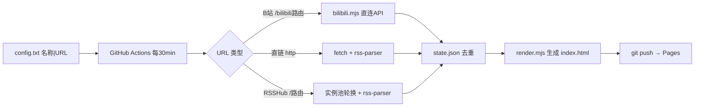

# RSS 订阅仪表盘

通用 RSS 源订阅：B站 UP 主、技术博客、GitHub Releases、新闻站等任意 RSS feed，统一聚合到一个静态网页。GitHub Actions 每 30 分钟拉取，GitHub Pages 托管。零服务器。

## 架构



纯拉取架构，零服务。直链源直接 fetch（5 并发）；B站路由走 B站 API 直连（WBI 签名 + cookie，避开公共 RSSHub 实例对 B站的风控）；其他 RSSHub 路由走实例池轮换。类别与源完全由 `config.txt` 驱动，新增/删除类别只需改 config。前端为单文件 SPA（内嵌 JSON，客户端日历筛选 + 滚动加载 + 搜索）。通用解析用 `rss-parser`（RSSHub 同款），支持 RSS 2.0/Atom/RDF + gzip + Dublin Core。

## 部署

1. **Fork 仓库**（公开仓库 Actions 免费不占额度）
2. **编辑 `config.txt`**，添加订阅：
   ```
   [分类|标题|图标|主题色]
   名称 | URL
   ```
   - 分类头：`[video|视频 UP 主|video|#fb7299]`
   - 直链：完整 RSS/Atom URL
   - RSSHub 路由：`/` 开头（如 `/bilibili/user/video/UID`），自动拼实例池
3. **开启 GitHub Pages**：Settings → Pages → Source 选 `GitHub Actions`（deploy.yml 自动部署 dist/）
4. **配置 `BILIBILI_COOKIE` Secret**（B站源必需）：浏览器登录 B站 → DevTools Network → 复制 Cookie → 仓库 Secrets 新建 `BILIBILI_COOKIE`
5. **手动触发首次同步**：Actions → `sync` → Run workflow
6. 约 1 分钟后访问 Pages URL

## 文件

| 文件 | 作用 |
| --- | --- |
| `config.txt` | 订阅列表（类别+源，唯一配置源） |
| `instances.txt` | RSSHub 公共实例池 |
| `scripts/fetch.mjs` | 同步核心：解析 config → 三路分发 → 去重 → 生成 |
| `scripts/bilibili.mjs` | B站 API 直连（WBI 签名 + cookie） |
| `scripts/render.mjs` | 单文件 SPA 渲染（日历 + 滚动加载 + 搜索） |
| `dist/` | 生成产物：`index.html`（单文件 SPA，内嵌 JSON）+ `state.json` |
| `.github/workflows/sync.yml` | Actions 定时任务（注入 BILIBILI_COOKIE） |
| `docs/prd.md` `docs/tech.md` | 需求规格与技术架构 |

## 本地运行

```bash
npm install
node scripts/fetch.mjs   # 产物输出到 dist/
```

需 Node 22+。

## 约束

- 实时性：GitHub Actions cron 不保证准时，实际延迟 5–35 分钟，非真实时
- B站路由走 API 直连，配 `BILIBILI_COOKIE` Secret 后稳定（匿名对热门 UP 易 -352 风控）
- 合规：底层依赖非公开 API（B站等），个人自用，勿商业化

### 配置 BILIBILI_COOKIE

1. 浏览器登录 [bilibili.com](https://www.bilibili.com)
2. F12 → Network → 刷新 → 点任一 bilibili.com 请求 → 复制 Cookie 整段（含 `SESSDATA`）
3. 仓库 Settings → Secrets and variables → Actions → New secret → Name `BILIBILI_COOKIE`，Value 粘贴
4. 下次 sync 自动使用

## 许可

MIT
