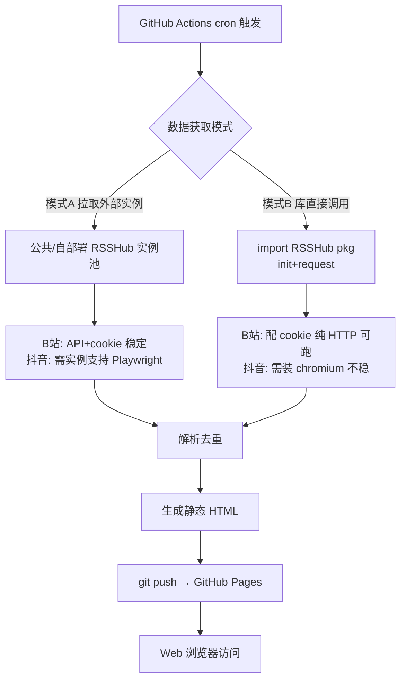
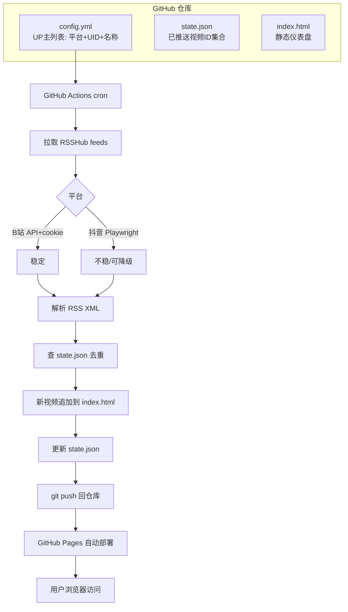

# UP 主视频订阅 · GitHub Actions 部署深度调研

Generated: 2026-08-19
Scope: RSSHub 源码级实现分析，聚焦"GitHub 托管网页版 + Actions workflow"部署方案的可行性、实时性边界与现成方案
方法: 直接克隆 [DIYgod/RSSHub](https://github.com/DIYgod/RSSHub) 与 [gqy20/rss2cubox](https://github.com/gqy20/rss2cubox) 源码逐文件分析，辅以部署配置与官方文档
关联文档: `video-subscription-tools.md`（宏观方案）

## 1. 调研目标与范围

确认"RSSHub + GitHub Actions + 静态仪表盘"方向的三个关键问题：

1. RSSHub 的 B站/抖音路由**源码到底怎么实现**反爬（WBI 签名、cookie、Playwright）？
2. RSSHub 能否**直接在 GitHub Actions 里运行**？还是只能拉取外部实例？
3. 是否有**现成的"Actions 拉 RSS → GitHub Pages 仪表盘"项目**可复用？

逐个击穿。源码已落盘至 `rsshub-src/`、`rss2cubox-src/`（工作目录下），结论均可回溯。

## 2. 核心结论



**三条关键判断**：

1. **B站可行且稳定**：`video.ts` 路由 `requirePuppeteer: false`，API 优先模式配 `BILIBILI_COOKIE_*` 后**纯 HTTP 运行**，无需浏览器，GitHub Actions 内可直接跑。
2. **抖音不稳定且重**：`user.ts` 路由 `requirePuppeteer: true, antiCrawler: true`，**必须** Playwright（patchright 反检测 fork），源码明确标注 `The request may be filtered by WAF`。GitHub Actions 内可装 chromium 但失败率高。
3. **"实时"是分钟级延迟**：GitHub Actions cron 最短 5 分钟且不保证准时，无 webhook 推送通道。所谓"实时"实际是 5–60 分钟级轮询延迟，需向用户管理此预期。

**推荐方案**：模式 A（拉取自部署 RSSHub 实例）+ GitHub Pages 静态仪表盘 + 仓库内 `state.json` 去重。B站为主，抖音作为不稳定补充。详见第 7 节。

## 3. RSSHub 源码级实现分析

### 3.1 B站 `video.ts` 路由（API 优先 + 浏览器兜底）

源码：`lib/routes/bilibili/video.ts`

```typescript
export const route: Route = {
    path: '/user/video/:uid/:embed?',
    features: {
        requirePuppeteer: false,   // 关键：不强制浏览器
        antiCrawler: false,
    },
};
```

**双轨机制**（`getVideoList`）：

```typescript
async function getVideoList(uid) {
    try {
        return await fetchVideoListFromApi(uid);      // 1. API 优先
    } catch (error) {
        return fetchVideoListFromBrowser(uid);         // 2. 兜底浏览器
    }
}
```

- **API 模式**（`fetchVideoListFromApi`）：请求 `https://api.bilibili.com/x/space/wbi/arc/search`，参数 `mid=${uid}&ps=30&order=pubdate&platform=web&web_location=1550101&order_avoided=true`，带 `Referer` + `Cookie`。
- **浏览器兜底**（`fetchVideoListFromBrowser`）：用 Playwright 打开 `space.bilibili.com/${uid}/video`，拦截同一条 `/x/space/wbi/arc/search` XHR 响应。超时配置：响应等待 45s、浏览器关闭 90s。
- **错误提示直指 cookie**：`Bilibili browser mode returned non-JSON response; BILIBILI_COOKIE_* may be required`。

> 结论：只要 API 模式成功（配置了有效 cookie），**全程不启动浏览器**。这是 B站能在 GitHub Actions 轻量跑通的根本原因。

### 3.2 WBI 签名与 Cookie 机制（`utils.ts` / `cache.ts`）

源码：`lib/routes/bilibili/utils.ts`、`lib/routes/bilibili/cache.ts`

**WBI 签名算法**（`addWbiVerifyInfo`）：

```typescript
function addWbiVerifyInfo(params, wbiVerifyString) {
    const searchParams = new URLSearchParams(params);
    searchParams.sort();                                    // 1. 参数按字典序排序
    const wts = Math.round(Date.now() / 1000);              // 2. 加时间戳 wts
    const w_rid = md5(`${verifyParam}&wts=${wts}${wbiVerifyString}`);  // 3. md5 得 w_rid
    return `${params}&w_rid=${w_rid}&wts=${wts}`;
}
```

**`wbiVerifyString` 来源**（`getWbiVerifyString`，`cache.ts`）：

1. 请求 `api.bilibili.com/x/web-interface/nav` 取 `wbi_img.img_url` / `sub_url`，拼接两个文件名得 `r`（64 字符）。
2. 下载固定 JS：`s1.hdslb.com/bfs/seed/laputa-header/bili-header.umd.js`，正则提取一个 64 元素的打乱索引数组。
3. 按数组索引重排 `r`，取前 32 位即 `wbiVerifyString`。

**dm_img 设备指纹**（`utils.ts`）：`getDmImgList` 用高斯随机生成"鼠标轨迹"，`getDmImgInter` 生成"页面交互指纹"（base64 编码的 DOM 元素位置）。若配置了 `BILIBILI_DM_IMG_LIST` / `DM_IMG_INTER` 则用配置值，否则随机生成。

**Cookie 获取**（`cache.ts`）：

```typescript
const getCookie = (disableConfig = false) => {
    const configuredCookie = disableConfig ? undefined : getConfiguredCookie();
    if (configuredCookie !== undefined) {
        return configuredCookie;                           // 配置了 cookie 直接返回
    }
    // 未配置：用 Playwright 访问 space.bilibili.com/1/dynamic，
    // 监听 nav 请求完成后读取浏览器 cookies
    return cache.tryGet('bili-cookie', async () => { ... });
};
```

> 结论：**配置 `BILIBILI_COOKIE_*` 后，`getCookie` 直接返回，不触发 Playwright**。WBI 签名、dm_img、renderData 全部走纯 HTTP。这是 GitHub Actions 部署的关键开关。

### 3.3 抖音 `user.ts` 路由（必须浏览器 + WAF 风险）

源码：`lib/routes/douyin/user.ts`

```typescript
export const route: Route = {
    path: '/user/:uid/:routeParams?',
    features: {
        requirePuppeteer: true,    // 强制浏览器
        antiCrawler: true,         // 标记反爬
    },
};
```

**机制**：

```typescript
const context = await playwright();
const page = await context.newPage();
await page.route('**/*', (route) => { /* 仅放行 document/script/xhr */ });
page.on('response', async (response) => {
    if (request.url().includes('/web/aweme/post') && !postData) {
        postData = await response.json();                   // 拦截视频列表 XHR
    }
});
await page.goto(`https://www.douyin.com/user/${uid}`, { waitUntil: 'networkidle' });

if (!postData) {
    throw new Error('Empty post data. The request may be filtered by WAF.');
}
```

- **无 API 模式**：抖音没有任何可用的纯 HTTP 接口，必须 Playwright 渲染页面拦截 XHR。
- **UID 校验**：必须以 `MS4wLjABAAAA` 开头。
- **WAF 显式风险**：拿不到 `postData` 即判定被 WAF 过滤，直接抛错。
- **缓存**：`cache.tryGet('douyin:user:${uid}', ..., config.cache.routeExpire)`，一次成功后缓存期内复用。

> 结论：抖音在 GitHub Actions 里需要 `playwright install chromium` + patchright 反检测，但抖音 WAF 对数据中心 IP（GitHub Actions 的 Azure IP 段）极不友好，失败率高。rss2cubox 的做法印证了这点（见 5.1）。

### 3.4 RSSHub 库 API（`pkg.ts`）—— 可在 Actions 内直接调用

源码：`lib/pkg.ts`，由 `package.json` 的 `exports` 字段导出（`dist-lib/pkg.mjs`）。

```typescript
export async function init(conf?: ConfigEnv) {
    setConfig(Object.assign({ IS_PACKAGE: true }, conf));
    app = (await import('@/app')).default;
}

export async function request(path: RoutePath | (string & {})) {
    ensureAppInitialized(app);
    const res = await app.request(path);
    return res.json() as Promise<Data>;                    // 返回结构化 JSON，非 RSS XML
}

export async function registerRoute(namespace, route, namespaceConfig?) { ... }
```

> 结论：RSSHub **可作为 npm 库被 import**，在 GitHub Actions 里 `init({ bilibili: { cookies } })` 后 `request('/bilibili/user/video/2267573')` 直接拿 JSON `Data`。比解析 RSS XML 更直接，且免去维护外部实例。但抖音路由仍需 Playwright 运行时。`package.json` 无 CLI 抓取命令，库调用是唯一程序化入口。

### 3.5 Playwright / patchright 反检测

`package.json` 依赖：

```json
"patchright": "1.61.1"              // 反检测 Playwright fork，绕过 CDP 指纹检测
"@cloudflare/playwright": "1.3.5"   // Cloudflare Browser Rendering 适配
```

patchright 是 Playwright 的补丁版，修复了多个自动化检测特征（`navigator.webdriver`、CDP 指纹等）。RSSHub 对抖音等强反爬站点统一用 patchright 而非原生 Playwright。

## 4. GitHub Actions 部署模式对比

三种模式，按"是否在 Actions 内运行 RSSHub"划分：

| 维度 | 模式A 拉取外部实例 | 模式B Actions 内调库 | 模式C 自部署实例+拉取 |
| --- | --- | --- | --- |
| RSSHub 运行位置 | 远端公共/私有实例 | Actions 内（`import` pkg） | 自部署 Vercel/CF |
| Actions 内是否装浏览器 | 否（可选） | B站否、抖音是 | 否 |
| B站稳定性 | 取决于实例 | 高（配 cookie 纯 HTTP） | 高 |
| 抖音稳定性 | 取决于实例是否支持浏览器 | 低（Azure IP 被 WAF） | 取决于部署平台 |
| 维护成本 | 低（实例池轮换） | 中（跟随 RSSHub 升级） | 高（自运维实例） |
| 额度消耗 | 低 | 中（抖音装 chromium 慢） | 低 |
| 代表实现 | rss2cubox | 理论可行（pkg.ts 验证） | RSSHub 官方推荐 |

### 4.1 模式A：拉取外部 RSSHub 实例

Actions 只做"HTTP 客户端"：cron 触发 → 请求 `https://<instance>/bilibili/user/video/:uid` → 解析 RSS XML → 去重 → 生成 HTML。

- 优点：Actions 环境干净、快、额度消耗低；实例故障可多实例轮换。
- 缺点：依赖外部实例可用性；公共实例限流；抖音需要实例端支持 Playwright。
- **真实案例**：rss2cubox（见 5.1），10 个实例池 + 3 次重试 + 60s 冷却。

### 4.2 模式B：Actions 内 import RSSHub 库

Actions 里 `npm i rsshub` → `init({ bilibili: { cookies: {...} } })` → `await request('/bilibili/user/video/:uid')` 拿 JSON。

- 优点：无外部实例依赖；B站纯 HTTP 可跑；数据是结构化 JSON 免解析。
- 缺点：RSSHub 依赖较重（patchright、hono 等数百包）；抖音需 `playwright install chromium`（约 +300s 安装 + 不稳定）；跟随 RSSHub 版本升级。
- 可行性：`pkg.ts` 已验证导出完整 API，`init` 接受 `ConfigEnv` 注入 cookie。**B站确定可行，抖音理论可行但实战不稳**。

### 4.3 模式C：自部署 RSSHub + Actions 拉取

自己部署一个 RSSHub 实例，Actions 定时拉取。部署平台决定 Playwright 支持：

| 平台 | 配置文件 | Playwright | 抖音可用 | 成本 |
| --- | --- | --- | --- | --- |
| Docker（VPS/NAS） | `Dockerfile` | ✅ 完整 | ✅ | 需服务器 |
| Cloudflare Containers | `wrangler-container.toml` | ✅ `PLAYWRIGHT_SKIP_BROWSER_DOWNLOAD=0` | ✅ | 免费额度 |
| Cloudflare Workers（付费） | `wrangler.toml` `[browser]` | ✅ Browser Rendering API | ✅ | $5/月 |
| Cloudflare Workers（免费） | 同上 | ⚠️ 10ms CPU 限制 | ❌ | 免费 |
| Vercel | `vercel.json` | ❌ 无浏览器环境 | ❌ | 免费 |

源码确认：
- `wrangler.toml`：`[browser] binding = "BROWSER"`，注释明确"Free plan has 10ms CPU time limit, Paid plan has 30s"。
- `wrangler-container.toml`：Docker 镜像部署，`PLAYWRIGHT_SKIP_BROWSER_DOWNLOAD = "0"`，`max_instances = 20`，完整浏览器。
- `vercel.json`：`framework: "hono"`，Vercel 是 serverless 无浏览器，抖音路由不可用。

> 结论：若要抖音，自部署只能选 Docker / CF Containers / CF Workers 付费版。Vercel 仅够 B站。GitHub Actions 不是 RSSHub 官方部署方式（它是长驻 Hono 服务，`.github/workflows/` 只有 docker 发布 CI）。

## 5. 现成方案调研

### 5.1 rss2cubox（拉取模式真实案例，高参考价值）

源码：`rss2cubox-src/`（已克隆）

**workflow**（`.github/workflows/rss_to_ic.yml`）：

```yaml
on:
  schedule:
    - cron: "0 */3 * * *"          # 每 3 小时
  workflow_dispatch:
permissions:
  contents: write
concurrency:
  group: rss2cubox
  cancel-in-progress: false        # 不中断进行中的运行
jobs:
  run:
    runs-on: ubuntu-latest
    steps:
      - uses: actions/checkout@v4
      - uses: actions/setup-python@v5
        with: { python-version: "3.11" }
      - run: python -m pip install .
      - run: python -m playwright install chromium    # 装 chromium
      - env:
          RSSHUB_BILIBILI_INSTANCES: ${{ secrets.RSSHUB_BILIBILI_INSTANCES || 'https://rss.spriple.org' }}
          RSSHUB_BILIBILI_RETRY_ATTEMPTS: "3"
          RSSHUB_FAILURE_COOLDOWN_SECONDS: "60"
          RSSHUB_INSTANCES_FILE: "rsshub_instances.txt"
        run: rss2cubox 2>&1 | tee rss2cubox.log
      - if: always()
        uses: actions/upload-artifact@v4             # 日志归档
```

**关键设计**：

1. **实例池**（`rsshub_instances.txt`）：10 个公共实例按成功率排序，失败 60s 冷却避免反复打挂的实例。
2. **B站用自定义 fork**：`gqy20/RSSHub` 的 `video-browser` 路由（`/bilibili/user/video-browser/:uid`），用 Puppeteer 渲染页面提取数据，**绕过 WBI 签名**。README 原话："使用 Puppeteer 渲染页面提取视频数据，绕过 Bilibili API 的 WBI 签名反爬"。
   > 这是个重要信号：实战中官方 `/bilibili/user/video` 的 API+WBI 路径易失效，作者宁可 fork 出浏览器渲染路由求稳。
3. **订阅格式**（`feeds.txt`）：`[rsshub]` / `[werss]` / `[direct]` 三段，每行 `优先级\t路由 # 别名`。
4. **去重**：基于外部信息库 `ic`（通过 `IC_API_URL` 批量导入），不依赖本地 state。
5. **AI 增强**：Claude Agent SDK 做文章分析（`ENRICH_AGENT_ENABLED`，单条预算 $0.15）。
6. **前端**：Vercel 部署 `web/` 目录（**非 GitHub Pages**），读 `ic` API + Neon DB。
7. **日志**：`upload-artifact` 存运行日志，Step Summary 含阶段耗时/熔断跳过数/去重数。

**对用户需求的可借鉴点**：实例池+重试+冷却机制、`feeds.txt` 订阅格式、`concurrency` 防并发、日志归档。**不可直接照搬点**：前端在 Vercel 非 Pages、去重靠外部 DB（用户场景应简化为仓库内 `state.json`）。

### 5.2 GitHub Pages RSS 仪表盘（空白）

用多组关键词在 GitHub 搜索（`rss dashboard github actions`、`rss feed github pages static`、`rss aggregator github actions`），结果均被 awesome-list 类仓库主导，**未发现成熟的"Actions 拉 RSS → 生成静态 HTML → GitHub Pages 展示"专用项目**。

最相关的是 [sansan0/TrendRadar](https://github.com/sansan0/TrendRadar)（AI 舆情监控 + RSS 聚合 + 多渠道推送，Docker 部署），但其定位是舆情监控而非 UP 主视频订阅，且部署模式（Docker）与用户需求（GitHub 托管）不符，stars/forks 比例异常，仅作参考。

> 结论：此细分场景无现成轮子，需自建。但rss2cubox 的拉取层 + 一个静态 HTML 生成器 + GitHub Pages 即可拼出，工作量可控。

## 6. 实时性约束与去重

### 6.1 GitHub Actions cron 限制

| 约束 | 值 | 影响 |
| --- | --- | --- |
| 最短 cron 间隔 | 5 分钟（`*/5 * * * *`） | 实时性上限 |
| 准时性 | **不保证**，高峰期延迟 10–30 分钟甚至跳过 | "实时"是伪命题 |
| 仓库静止暂停 | 60 天无活动自动停 scheduled workflow | 需定期触发保持活跃 |
| 单 job 上限 | 6 小时 | 足够拉取百级 feed |
| 公开仓库 | 免费，不占分钟额度 | 推荐公开仓库部署 |
| 私有仓库 | 2000 分钟/月免费 | 每 3h 跑一次约耗 60–100 分钟/月，够用 |

GitHub 官方明确：scheduled workflows 在 Actions 高负载期间会被延迟或跳过，且不保证精确到秒。**这是架构层面的硬约束，无法通过代码消除**。

### 6.2 "实时"的实际边界

B站/抖音均**不提供视频更新的 webhook 推送**，所有订阅都是轮询（pull）模式：

- 最快路径：5 分钟 cron → 实际延迟 5–35 分钟 → 用户看到更新。
- 抖音额外延迟：WAF 导致抓取失败时，下一次 cron 才重试，延迟翻倍。
- rss2cubox 用 3 小时间隔，说明社区对"准实时"的容忍度较高。

> 建议：向用户明确"近实时"而非"实时"，cron 设 `*/15` 或 `*/30`（5 分钟过密易触发平台限流且额度浪费）。

### 6.3 去重与状态管理

| 方案 | 存储 | 优点 | 缺点 |
| --- | --- | --- | --- |
| 仓库内 `state.json` | git commit 回仓库 | 自包含、可审计、与 Pages 同库 | 每次运行产生 commit，历史膨胀 |
| `actions/cache` | GH 缓存 | 不污染提交历史 | 7 天未访问失效、分支隔离 |
| GitHub Issues | issue 评论存 ID | 可视化、可订阅通知 | hack 味重、上限低 |
| 外部 DB（Neon/Supabase） | 云数据库 | 专业、可多端共享 | 超出"零服务器"约束 |

**推荐**：仓库内 `state.json`（记录每个 UP 主已见视频 ID 的集合）+ Actions 自动 commit。配合 `.gitignore` 忽略中间产物，仅提交 `state.json` 与 `index.html`。rss2cubox 用外部 DB 是因为它有 AI 增强和多端消费需求，用户场景更简单，`state.json` 足够。

## 7. 推荐架构



**分层建议**：

- **数据源（B站）**：模式 A 拉取自部署实例（Vercel 免费版即可，B站不需 Playwright），或模式 B 直接调库（配 `BILIBILI_COOKIE_*`）。二选一，模式 B 更省心。
- **数据源（抖音）**：降级处理。若必须支持，自部署 CF Containers/Workers 付费版实例（支持 Playwright），并接受 30%+ 失败率。否则只订阅 B站（多数 UP 主多平台分发）。
- **展示**：GitHub Pages 静态 HTML，按 UP 主分组，显示标题/缩略图/链接/发布时间。
- **去重**：仓库内 `state.json`，Actions 自动 commit。
- **频率**：`cron: "*/30 * * * *"`（每 30 分钟），平衡实时性与限流。

**最小可行版本（MVP）**：仅 B站 + 模式 A 公共实例 + GitHub Pages + `state.json` 去重。验证通后再加自部署/抖音。

## 8. 风险与合规

| 风险 | 等级 | 说明与缓解 |
| --- | --- | --- |
| 抖音 WAF 过滤 | 高 | 源码显式 `filtered by WAF`；GitHub Actions 的 Azure IP 段易被标记。降级为 B站或自部署带浏览器的实例 |
| B站 WBI 签名失效 | 中 | RSSHub 维护者持续跟进；模式 B 调库可跟随升级；cookie 失效需手动更新 |
| GitHub Actions 延迟/跳过 | 中 | 架构硬约束；`workflow_dispatch` 手动补跑；公开仓库避免额度问题 |
| 公共 RSSHub 实例限流 | 中 | 多实例轮换（rss2cubox 模式）；或自部署 |
| 合规风险 | 中 | B站底层依赖非公开 API，`bilibili-API-collect` 已因律师函下线（2026-01-28）。个人自用风险低，勿商业化；抖音无公开 API，抓取依赖浏览器模拟 |
| cookie 泄露 | 高 | `BILIBILI_COOKIE_*` 必须用 GitHub Secrets，**严禁入库**；仓库需公开时尤其注意 |

## 9. 验证路径

1. **第 1 步（手动验证 B站）**：浏览器访问 `https://rsshub.app/bilibili/user/video/<UID>`，确认 RSS 正常返回最新视频。同时验证 `rsshub-src/lib/routes/bilibili/video.ts` 的 API 参数（`ps=30&order=pubdate`）。
2. **第 2 步（模式 A MVP）**：建公开仓库，写 `config.yml` + Actions workflow 拉公共实例 RSS + 生成 `index.html` + `state.json` 去重 + push 到 Pages。验证 cron 与去重。
3. **第 3 步（模式 B 对比）**：Actions 内 `npm i rsshub` + `init({bilibili:{cookies}})` + `request('/bilibili/user/video/:uid')`，对比模式 A 的稳定性与额度消耗，择优。
4. **第 4 步（抖音评估）**：加抖音订阅，跑一周统计成功率。若 <70% 则降级为仅 B站，或自部署 CF Containers 实例重试。
5. **第 5 步（自部署实例）**：B站流量大时自部署 Vercel（免费、B站够用）；抖音必须时自部署 CF Workers 付费版或 Containers。

## 10. Sources

### 源码（已克隆至工作目录，访问日期 2026-08-19）

**RSSHub**（`rsshub-src/`，[DIYgod/RSSHub](https://github.com/DIYgod/RSSHub)，AGPL-3.0）：

- `lib/routes/bilibili/video.ts` — `/user/video/:uid`，`requirePuppeteer: false`，API 优先 + Playwright 兜底，API 参数 `ps=30&order=pubdate`
- `lib/routes/bilibili/utils.ts` — WBI 签名 `addWbiVerifyInfo`（sort+wts+md5）、dm_img 指纹 `getDmImgList`/`getDmImgInter`
- `lib/routes/bilibili/cache.ts` — `getCookie`（配置优先纯 HTTP）、`getWbiVerifyString`（nav API + bili-header.umd.js 打乱数组）
- `lib/routes/douyin/user.ts` — `/user/:uid`，`requirePuppeteer: true, antiCrawler: true`，拦截 `/web/aweme/post`，`filtered by WAF` 错误
- `lib/routes/douyin/utils.ts` — 视频地址解析、反代、头像处理
- `lib/pkg.ts` — 库导出 `init`/`request`/`registerRoute`，`IS_PACKAGE: true`
- `package.json` — `patchright@1.61.1`（反检测）、`@cloudflare/playwright`、`exports` 指向 `dist-lib/pkg.mjs`、Node `^22.22.2||^24.15.0`、无 CLI 抓取命令
- `vercel.json` — `framework: hono`，Vercel 无 Playwright
- `wrangler.toml` — `[browser] binding = "BROWSER"`，免费版 10ms CPU / 付费 30s
- `wrangler-container.toml` — Docker 容器，`PLAYWRIGHT_SKIP_BROWSER_DOWNLOAD=0`，完整 Playwright
- `Dockerfile` / `docker-compose.yml` — Docker 部署（完整浏览器）

**rss2cubox**（`rss2cubox-src/`，[gqy20/rss2cubox](https://github.com/gqy20/rss2cubox)）：

- `.github/workflows/rss_to_ic.yml` — `cron: "0 */3 * * *"`、concurrency 防并发、`playwright install chromium`、upload-artifact 日志
- `README.md` — 架构说明，B站用自定义 fork `video-browser` 路由绕 WBI 签名
- `rsshub_instances.txt` — 10 个公共实例池，按成功率排序
- `feeds.txt` — `[rsshub]`/`[werss]`/`[direct]` 分类订阅，优先级 + 别名
- 自定义 fork：[gqy20/RSSHub](https://github.com/gqy20/RSSHub) — `video-browser` 路由用 Puppeteer 渲染绕 WBI

### 相关项目

- [AboutRSS/ALL-about-RSS](https://github.com/AboutRSS/ALL-about-RSS) — RSS 资源索引（无直接可用仪表盘）
- [sansan0/TrendRadar](https://github.com/sansan0/TrendRadar) — AI 舆情 + RSS 聚合，Docker 部署，定位不同，stars/forks 异常仅作参考
- [ValMystletainn/infiv](https://github.com/ValMystletainn/infiv) — `.github/workflows/daily_flow.yaml` checkout rsshub 改造版 + `BILIBILI_COOKIE`，另一 Actions+RSSHub 案例

### 官方文档与已知问题（P1）

- [RSSHub 部署指南](https://docs.rsshub.app/install/) — Docker/Vercel/CF Workers/Containers
- [Cloudflare Browser Rendering](https://developers.cloudflare.com/browser-rendering/) — Workers 付费版 Playwright 支持
- [GitHub Actions scheduled workflows 限制](https://docs.github.com/en/actions/using-workflows/events-that-trigger-workflows#schedule) — cron 5 分钟最小、不保证准时、60 天静止暂停
- [RSSHub Issue #20277](https://github.com/DIYgod/RSSHub/issues/20277) — 抖音 feed 缺最新视频（WAF）
- bilibili-API-collect 律师函下线（2026-01-28） — B站非公开 API 逆向的合规风险

### 访问限制总结

- B站：配 `BILIBILI_COOKIE_*` 后纯 HTTP 可跑，GitHub Actions 友好；cookie 需用 Secrets
- 抖音：必须 Playwright + patchright，WAF 对数据中心 IP 不友好，GitHub Actions 内失败率高
- RSSHub：长驻 Hono 服务，官方部署不含 GitHub Actions；Actions 内只能拉取或调库
- 实时性：无 webhook，cron 轮询最快 5 分钟、实际 5–35 分钟延迟，是架构硬约束
