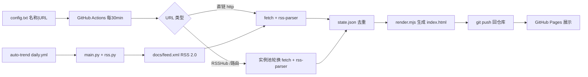

# TECH · RSS 订阅仪表盘技术架构

## 1. 架构总览



**纯拉取架构**：消费端只做拉取-解析-去重-渲染，零服务。不部署 RSSHub。

**三路分发**：`fetch.mjs` 按 URL 前缀路由——`/bilibili/user/video/:uid` 走 B站 API 直连（`bilibili.mjs`，WBI 签名，配 `BILIBILI_COOKIE` 后稳定），`/` 开头的其他 RSSHub 路由走实例池轮换，`http` 开头的直链直接 fetch。B站路由独立于实例池，因公共 RSSHub 实例对 B站普遍风控。

**auto-trend RSS 输出**：auto-trend 项目每日生成 Markdown 日报的同时，通过 `scripts/rss.py` 渲染 RSS 2.0 XML（`docs/feed.xml`），GitHub Pages 公网可达。rss-feed 在 config.txt 中将其作为普通直链源拉取，无需特殊代码。

## 2. 核心组件

### 2.1 config.txt — 订阅配置

分类头 `[id|标题|主题色]` + 源行 `名称 | URL`。类别与源完全由此文件驱动，新增/删除类别只需改此文件。

**7 分类 139 源**：

| 分类 | 标题 | 源数 | 说明 |
|---|---|---|---|
| `video` | 视频 | 21 | B站学术/官方 UP + YouTube 科技频道 + FluxSift（cpolar 隧道） |
| `ai` | AI 动态 | 24 | AI 实验室博客 + 研究者博客 |
| `arxiv` | arXiv 论文 | 30 | 全 CS 分类 + 统计/物理/数学/生物 |
| `papers` | 会议/期刊 | 10 | ACL/JMLR/Nature/Science/MIT/Stanford |
| `tech` | 技术博客 | 25 | 顶级工程博客 + 官方语言博客 |
| `news` | 资讯媒体 | 12 | 中英文科技媒体 |
| `community` | 开发者社区 | 17 | HN/V2EX/Reddit + auto-trend 日报 |

### 2.2 instances.txt — RSSHub 实例池

公共实例列表，按成功率排序，RSSHub 路由源失败时轮换。

### 2.3 scripts/fetch.mjs — 同步核心

- 解析 config.txt 的类别与源
- 三路分发：
  - `/bilibili/user/video/:uid` → B站 API 直连（`bilibili.mjs`）
  - `/` 开头（其他 RSSHub 路由）→ 实例池轮换 fetch + rss-parser
   - `http` 开头 → 直接 fetch + rss-parser（5 并发，2 次重试；YouTube 限流严格，3 次重试 + 2s 间隔）
- 去重 key = URL，新 ID 置前合并保留 100 条
- 失败源保留旧 state，记录错误
- 调 `render.mjs` 生成 HTML + 写 state.json

### 2.4 scripts/render.mjs — 前端渲染

单文件 SPA：`renderSPA(data)` 生成完整 HTML，内嵌 JSON 数据，客户端渲染侧边栏分类 + 卡片式列表 + 日历视图。导出 `renderSPA`/`platformColor`。

**列表视图**：
- 左侧侧边栏：搜索框 + 分类列表（源色点 + 标题 + 条目数徽章 + 失败源⚠徽章）+ 失败源折叠区 + 时间筛选（全部/24h/7天/30天）
- 主区域：头部（当前筛选 + 条目数 + 更新时间 + 视图切换）+ 卡片列表
- 卡片：源色点 + 源名 + 标题（2 行截断）+ 摘要预览 + 时间 + 分类标签 + 未读蓝点
- 24h 内条目 `.fresh` 高亮（左侧色条 + 标题橙色）；新条目 `.unread` 浅蓝背景
- 无限滚动（IntersectionObserver，每批 50 条，400px 预加载）
- 滚动位置记忆：切换分类/搜索后切回恢复 scrollTop

**日历视图**：
- 月历网格（周一到周日，今日橙色高亮、选中日蓝色描边）
- 日期格显示条目数 + 分类色点（最多 5 个）；空格半透明、outside 格可点击跳月
- 点日期下半区显示该日条目卡片；月份导航 ‹/›/今天 + 方向键 ←→ 切月
- 搜索时工具栏显示「搜索: "xxx" 清除」指示

**交互**：
- 已读状态：localStorage 持久化，点击卡片标记已读，新条目（freshIds）显示未读
- 搜索防抖（180ms），匹配标题与源名
- 键盘可达：分类项/日期均为 `<button>`，`/` 聚焦搜索，Esc 关闭侧边栏
- 暗色/浅色自适应（浅色 `--accent` 满足 WCAG AA 对比度）
- 移动端：侧边栏抽屉式 + 左滑关闭，日历色点缩到 3px

### 2.5 state.json — 去重状态

`{ url: [条目ID...] }`，仓库内提交持久化。

### 2.6 .github/workflows/sync.yml — 定时任务

定时拉取 → 提交产物 → 部署 Pages，concurrency 防并发。注入 `BILIBILI_COOKIE` Secret。

## 3. 通用 RSS 解析

用 `rss-parser`（RSSHub 同款 `rss-parser@3.13.0`），支持：

- RSS 2.0 / Atom / RDF 三种格式
- gzip / deflate / brotli 压缩
- Dublin Core `dc:date`
- CDATA 与实体转义

解析字段：`{ title, link, id(=guid 或 link), pubDate, description(≤200字) }`。

**为何不用自写正则**：CDATA vs 实体转义、dc:date、压缩均已由 rss-parser 处理，对齐 RSSHub 实现更稳。

## 4. 去重设计

- key：源 URL（通用唯一）
- value：条目 ID 数组（`guid` 优先，fallback `link` 末段）
- 新条目 ID 置前，`[...new Set([...fresh, ...old])].slice(0, 100)`
- 源失败：`newState[key] = state[key] || []`（保留旧）

## 5. auto-trend RSS 接入

auto-trend 项目（`https://github.com/int2t05/auto-trend`）每日通过 GitHub Actions 生成 GitHub Trending + RSS 热点的 LLM 分析日报。

**RSS 输出流程**：
1. `scripts/rss.py` 的 `render_rss_feed(repos, analyses, report_date)` 将结构化数据渲染为 RSS 2.0 XML
2. 每个 trending repo / RSS 热点作为一条 item：`title` = repo 全名，`description` = LLM summary，`content:encoded` = 完整分析 HTML
3. `scripts/main.py` 在生成 Markdown 日报后追加调用，写入 `docs/feed.xml`
4. `git_commit_and_push` 同时提交日报和 feed.xml
5. GitHub Pages 公网可达：`https://int2t05.github.io/auto-trend/feed.xml`

**rss-feed 侧**：config.txt 中 community 分类下配置为普通直链源，fetch.mjs 当作普通 RSS 2.0 处理，无需特殊代码。

## 6. FluxSift 接入

FluxSift 的 RSS feed 在 `http://<host>:8765/feed/<FEED_TOKEN>.xml`（内网 + token 鉴权）。GitHub Actions 云端无法直接访问内网。

**方案**：经 cpolar 公网隧道暴露内网 FluxSift serve，config.txt 中 video 分类下配置为直链源。fetch.mjs 当作普通直链源处理，错误处理优雅降级（隧道断时保留旧 state，不中断其他源）。隧道 URL 变更时改 config.txt 对应行。

## 7. 部署

- 公开仓库 + GitHub Pages（main / root）
- Actions：`cron: "*/30 * * * *"` + `workflow_dispatch`

## 8. 依赖

- `rss-parser@^3.13.0`（唯一运行时依赖）
- Node 22+（fetch、`import.meta.dirname`、`AbortSignal.timeout`）

## 9. 文件结构

```
rss-feed/
├── config.txt              # 订阅列表（8 分类 139 源，唯一配置源）
├── instances.txt           # RSSHub 实例池
├── package.json            # rss-parser 依赖
├── dist/                   # 生成产物（GitHub Pages 源）
│   ├── index.html          # 单文件 SPA（内嵌 JSON）
│   └── state.json          # 去重状态
├── .gitignore
├── LICENSE                 # MIT
├── README.md
├── docs/
│   ├── prd.md              # 产品需求
│   ├── tech.md             # 技术架构
│   └── research/           # 调研归档
└── scripts/
    ├── fetch.mjs           # 同步核心（三路分发）
    ├── bilibili.mjs        # B站 API 直连（WBI 签名）
    └── render.mjs          # 前端渲染（侧边栏 + 卡片 + 日历 + 无限滚动 + 搜索）
```

## 10. 风险与缓解

| 风险 | 缓解 |
|---|---|
| RSSHub 公共实例限流/挂 | 实例池轮换 + 失败保留旧 state |
| Actions cron 延迟 | 架构硬约束，向用户明示近实时 |
| B站 API 风控 | 配 BILIBILI_COOKIE + 3 次重试 |
| auto-trend feed 不可达 | 源失败保留旧 state，不影响其他源 |
| FluxSift 内网不可达 | 注释形式存在，仅本地可用 |
