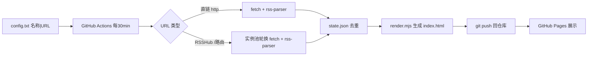

# TECH · RSS 订阅仪表盘技术架构

## 1. 架构总览



**纯拉取架构**：消费端只做拉取-解析-去重-渲染，零服务。不部署 RSSHub。

**三路分发**：`fetch.mjs` 按 URL 前缀路由——`/bilibili/user/video/:uid` 走 B站 API 直连（`bilibili.mjs`，WBI 签名，配 `BILIBILI_COOKIE` 后稳定），`/` 开头的其他 RSSHub 路由走实例池轮换，`http` 开头的直链直接 fetch。B站路由独立于实例池，因公共 RSSHub 实例对 B站普遍风控。

## 2. 核心组件

### 2.1 config.txt — 订阅配置

分类头 `[id|标题|图标|主题色]` + 源行 `名称 | URL | 显示条数`。类别与源完全由此文件驱动，新增/删除类别只需改此文件。

### 2.2 instances.txt — RSSHub 实例池

公共实例列表，按成功率排序，RSSHub 路由源失败时轮换。

### 2.3 scripts/fetch.mjs — 同步核心

- 解析 config.txt 的类别与源
- 三路分发：
  - `/bilibili/user/video/:uid` → B站 API 直连（`bilibili.mjs`）
  - `/` 开头（其他 RSSHub 路由）→ 实例池轮换 fetch + rss-parser
  - `http` 开头 → 直接 fetch + rss-parser（5 并发，1 次重试）
- 去重 key = URL，新 ID 置前合并保留 100 条
- 失败源保留旧 state，记录错误
- 调 `render.mjs` 生成 HTML + 写 state.json

### 2.4 scripts/render.mjs — 前端渲染

单文件 SPA：`renderSPA(data)` 生成完整 HTML，内嵌 JSON 数据，客户端 JS 渲染日历筛选 + 滚动加载 + 类别切换 + 搜索。导出 `renderSPA`/`platformColor`。

### 2.5 state.json — 去重状态

`{ url: [条目ID...] }`，仓库内提交持久化。

### 2.6 .github/workflows/sync.yml — 定时任务

定时拉取 → 提交产物 → 部署 Pages，concurrency 防并发。注入 `BILIBILI_COOKIE` Secret。

## 3. 通用 RSS 解析

用 `rss-parser`（RSSHub 同款 `rss-parser@3.13.0`），支持：

- RSS 2.0 / Atom / RDF 三种格式
- gzip / deflate / brotli 压缩
- Dublin Core `dc:date`
- CDATA 与实体转义

解析字段：`{ title, link, id(=guid 或 link), pubDate, author }`。

**为何不用自写正则**：CDATA vs 实体转义、dc:date、压缩均已由 rss-parser 处理，对齐 RSSHub 实现更稳。

## 4. 去重设计

- key：源 URL（通用唯一）
- value：条目 ID 数组（`guid` 优先，fallback `link` 末段）
- 新条目 ID 置前，`[...new Set([...fresh, ...old])].slice(0, 100)`
- 源失败：`newState[key] = state[key] || []`（保留旧）

## 5. 前端设计

单文件 SPA，暗色主题，客户端渲染：

- 左侧主区域：条目按时间倒序，每条显示相对时间 + 源名 + 标题，默认 50 条，"显示更多"按钮每次加 50
- 右侧日历：月视图，有内容的日期带标记，点击筛选当天条目
- 顶部导航：类别切换（全部/各类），客户端筛选，hash 路由
- 搜索框：标题实时搜索
- 24h 内条目标记为 fresh（橙色）
- `@media(max-width:860px)` 移动端隐藏日历
- `@media(prefers-color-scheme:light)` 浅色自适应

## 6. 部署

- 公开仓库 + GitHub Pages（main / root）
- Actions：`cron: "*/30 * * * *"` + `workflow_dispatch`

## 7. 依赖

- `rss-parser@^3.13.0`（唯一运行时依赖）
- Node 22+（fetch、`import.meta.dirname`、`AbortSignal.timeout`）

## 8. 文件结构

```
rss-feed/
├── config.txt              # 订阅列表（类别+源，唯一配置源）
├── instances.txt           # RSSHub 实例池
├── package.json            # rss-parser 依赖
├── dist/                   # 生成产物（GitHub Pages 源）
│   ├── index.html          # 单文件 SPA（内嵌 JSON）
│   └── state.json          # 去重状态
├── .gitignore
├── LICENSE                 # MIT（bilibili.mjs 为独立实现，未派生 RSSHub 代码）
├── README.md
├── docs/
│   ├── prd.md              # 产品需求
│   ├── tech.md             # 技术架构
│   └── research/           # 调研归档
└── scripts/
    ├── fetch.mjs           # 同步核心（三路分发）
    ├── bilibili.mjs        # B站 API 直连（WBI 签名）
    └── render.mjs          # 前端渲染
```

## 9. 风险与缓解

| 风险                   | 缓解                          |
| ---------------------- | ----------------------------- |
| RSSHub 公共实例限流/挂 | 实例池轮换 + 失败保留旧 state |
| Actions cron 延迟      | 架构硬约束，向用户明示近实时  |
| B站 API 风控           | 配 BILIBILI_COOKIE + 3 次重试 |
